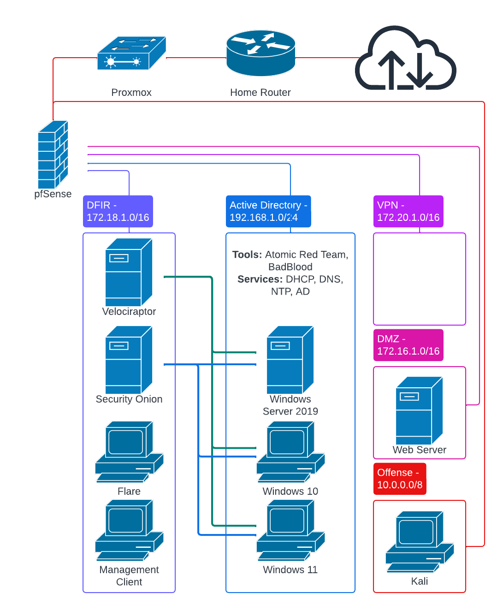

# **Home Lab**  

This repository contains scripts, configurations, and documentation for setting up and managing a home lab environment. Designed for forensics, threat detection, hunting, and automation, this lab leverages various tools and technologies for a cybersecurity learning and research platform.  

The goal is to provide recommendations and explain the purpose behind each lab component, supported by insights into key challenges, design decisions, and troubleshooting scenarios.  

## **Table of Contents**  

### **Documentation**  
- [Steps](Documentation/steps.md)  
- [Digital Forensics](Documentation/digital_forensics.md)  
- [SIEM Engineering](Documentation/siem_engineering.md)  
- [Malware Analysis](Documentation/malware_analysis.md)  
- [Network Security](Documentation/network_security.md)  
- [Active Directory](Documentation/active_directory.md)

### **Publications**

These articles come from my [Medium.com blog](https://medium.com/@logan.flecke) of tutorials and insights into cybersecurity and cybersecurity home labs. The Markdown is copied from Medium to GitHub, omitting images, while the original publications can be found on Medium.

- [Installing Proxmox on Dell PowerEdge Server and Creating an Internal Network](Publications/proxmox_install.md)
- [Turning Windows 11 into a Malware Analysis Sandbox](Publications/flare_install.md)
- [Threat Detection and Response Home Lab](Publications/home_lab.md)

### **Scripts**

- [Proxmox Network Reboot](Scripts/network_reboot.sh) is used whenever the server running Proxmox boots up to reinitialize the IP address assigned to it by the router.
- [Domain Controller Setup](Scripts/Install-Windows-Features.ps1) promotes a Windows Server 2025 to a Domain Controller by installing Active Directory, DNS, DHCP, and NTP services. RDP is enabled here to enhance availability and IP addressing is configured.
- [Lab Emulation Toolset](Scripts/Install-Emulation-Components.ps1) installs the tools necessary to execute and analyze endpoint and Active Directory attacks by installing the Elastic Agent, BadBlood, and Atomic Red Team. The beginnings of a network share are set up to enable seamless distribution of Elastic Agents to other domain-joined computers.

## **Overview**  

This project showcases a home lab setup tailored to cybersecurity detection, hunting, and automation. It serves as a foundation for exploring advanced tools and concepts in networking and security, incorporating:  
- **Troubleshooting**: Hands-on problem-solving for common and complex issues.  
- **Research & Learning Outcomes**: Practical application of research in detection, analysis, and response.  
- **Forensics and Hunting**: Using tools like Security Onion and Velociraptor to investigate and hunt threats.  
- **Enterprise Network Replication**: Simulating a realistic network environment with Active Directory, segmented subnets, and vulnerable configurations.  

Key technologies used include Proxmox, Windows OS, Security Onion, Velociraptor, Flare VM, Atomic Red Team, and BadBlood.  

  

## **Contributing**  

Contributions are welcome! If you have ideas for improvements, feel free to open issues or submit pull requests. Help expand the repository to benefit the cybersecurity community.  
