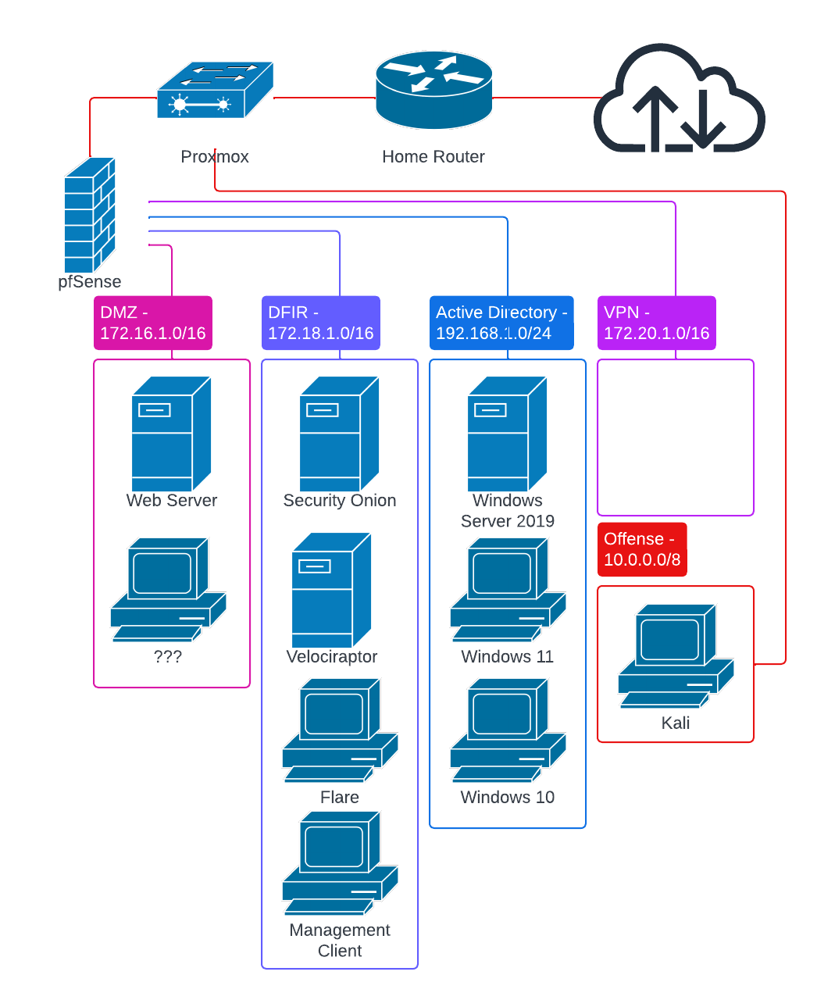

# Home Lab

This repository contains scripts, configurations, and documentation for setting up and managing a home lab environment. The lab is designed for forensics, threat detection and hunting, and automation purposes, leveraging various tools and technologies.

Goal is to give the recommendations and purpose behind each element of the home lab, supported with the high level and important (troubleshooting challenge, design decisions, difficult concepts).

## Table of Contents

**Documentation**
- [Steps](Documentation/steps.md)
- [Digital Forensics](Documentation/digital_forensics.md)
- [Threat Hunting](Documentation/threat_hunting.md)
- [SIEM Engineering](Documentation/siem_engineering.md)
- [Malware Analysis](Documentation/malware_analysis.md)
- [Network Security](Documentation/network_security.md)
- [Active Directory](Documentation/active_directory.md)

## Overview

This project showcases a home lab setup aimed at cybersecurity detection and automation. It provides a foundation for experimenting with various networking and security tools, including Proxmox, Open vSwitch (OVS), and other open-source security solutions like Wazuh.

The lab environment includes:
- List of stuff liek "troubleshooting", "research/learning outcomes", "forensics/hunting/etc", "replication of enterprise network"

## Contributing

Contributions are welcome! Feel free to open issues or submit pull requests to enhance this repository.
